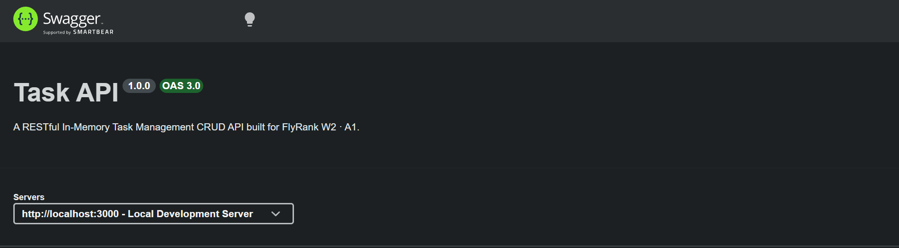
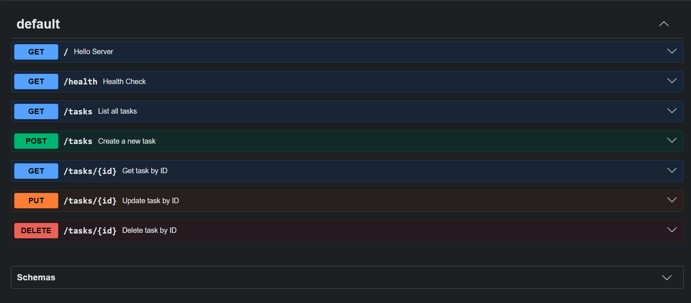

# FlyRank W2 · A1 — Build Your First CRUD API (JavaScript Lane)

A clean, modular, in-memory RESTful Task Management API built with Node.js and Express for the FlyRank Backend Engineering Internship.

---

## 🚀 Quickstart Guide

### Prerequisites
* [Node.js](https://nodejs.org/) (v16+ recommended)
* `npm` (packaged with Node.js)

### 1. Installation
Clone the repository and install dependencies:

```bash
git clone https://github.com/Ali2006-NED/W2-A1.git
cd W2-AI
npm install
```
### 2. Start the Server
Run the local development server:

```bash
npm start
# or node index.js
```


| Method | Endpoint | Description | Status Codes |
|:---:|---|---|---|
|  | `/` | Smoke Test Endpoint | `200` |
|  | `/health` | Server Health Check | `200` |
|  | `/tasks` | List all tasks | `200` |
|  | `/tasks/:id` | Get task by ID | `200` `404` |
|  | `/tasks` | Create a new task | `201` `400` |
|  | `/tasks/:id` | Update task by ID | `200` `400` `404` |
|  | `/tasks/:id` | Delete task by ID | `204` `404` |


## 🖥️ Interactive Swagger UI Documentation
Interactive OpenAPI documentation is powered by swagger-ui-express and available at:

👉 http://localhost:3000/docs

### 🧪 Terminal Verification (curl -i Output)
1. Creating a Task (POST /tasks)
```Bash
curl -i -X POST http://localhost:3000/tasks \
-H "Content-Type: application/json" \
-d '{"title":"Buy milk"}'
```

Output:

HTTP
HTTP/1.1 201 Created
X-Powered-By: Express
Content-Type: application/json; charset=utf-8
Content-Length: 39

```json
{"id":4,"title":"Buy milk","done":false}
```

### 2. Handling Missing Resources (GET /tasks/99)
Bash
curl -i http://localhost:3000/tasks/99

Output:

HTTP
HTTP/1.1 404 Not Found
X-Powered-By: Express
Content-Type: application/json; charset=utf-8
Content-Length: 31

```json
{"error":"Task 99 not found"}
```

## Swagger UI Screenshot



## 🔬 Mortality Experiment Observation
What happens when you create tasks, restart the server, and run GET /tasks?

When the server restarts, all dynamically created or updated tasks disappear, and the list resets back to the initial 3 seed tasks.

Why?

This occurs because the dataset is currently stored in volatile RAM (In-Memory) within Node.js process variables. Once the process terminates or restarts, memory is wiped clean. This demonstrates why real-world applications require persistent datastores (databases) like PostgreSQL or MongoDB to store data permanently across application restarts.